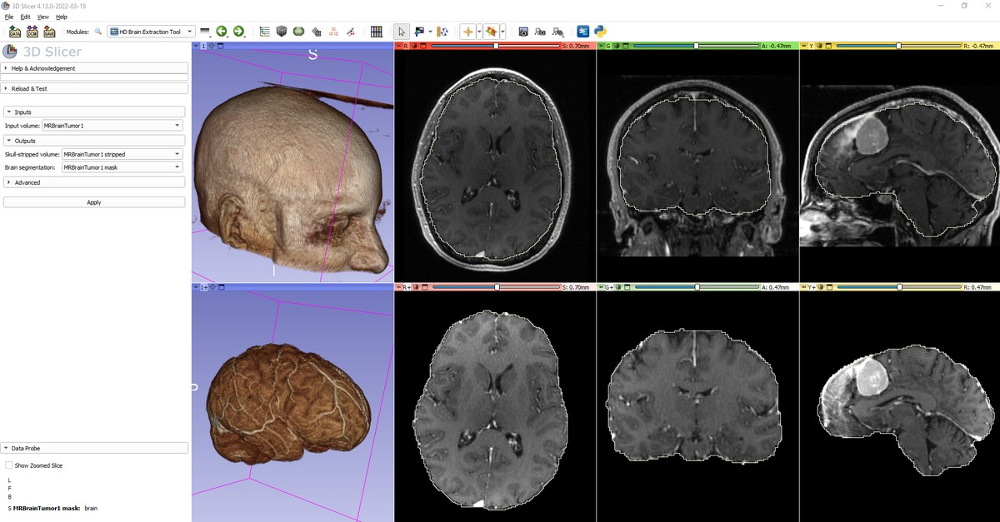

# SlicerHDBrainExtraction

3D Slicer extension for skull stripping in brain MRI images using [HD-BET brain extraction tool](https://github.com/MIC-DKFZ/HD-BET).

As per request of the HD-BET team, if you are using HD-BET, please cite the following publication:

> Isensee F, Schell M, Tursunova I, Brugnara G, Bonekamp D, Neuberger U, Wick A, Schlemmer HP, Heiland S, Wick W, Bendszus M, Maier-Hein KH, Kickingereder P. Automated brain extraction of multi-sequence MRI using artificial neural networks. Hum Brain Mapp. 2019; 1–13. https://doi.org/10.1002/hbm.24750

## Tutorial

- Install latest Slicer Preview Release of [3D Slicer](https://slicer.readthedocs.io/en/latest/user_guide/getting_started.html#installing-3d-slicer)
- [Install `HDBrainExtraction` extension](https://slicer.readthedocs.io/en/latest/user_guide/extensions_manager.html#install-extensions)
- Start 3D Slicer
- Go to `Sample Data` module and load `MRBrainTumor1` data set
- Go to `HD Brain Extraction Tool` module
- Select `Input volume` -> `MRBrainTumor1`
- Select `Skull-stripped volume` -> `Create new volume`
- Select `Brain segmentation` -> `Create new segmentation`
- Click `Apply`
- If you are prompted to install any additional packages then accept that and wait for a couple of minutes.
- If a GPU is available then results are computed within about 20 seconds. If computation is done on CPU then it may take 5-10 minutes!

## User interface

- Inputs
  - Input volume: input brain MRI
- Outputs
  - Skull-stripped volume: if a volume node is selected here then it will contain the skull-strippted volume (i.e., a volume where region outside the brain is blanked out)
  - Brain segmentation: if a segmentation node is selected here then it will contain a brain segment, which specifies the brain region
- Advanced:
  - Device:
     - auto: first GPU is used if CUDA is installed; otherwise CPU is used
     - cpu: use the CPU for computation, it is slower and may produce slightly lower quality result
     - gpu N: use the N-th GPU

Note: HD-BET downloads the model file (about 65MB) in the user's home directory in `hd-bet_params` folder. The folder can be removed if HD-BET is no longer used (the tool downloads the model again if needed).

## Contact

Please post any questions to the [Slicer Forum](https://discourse.slicer.org).

Developers of this extension are not associated with the developers of the HD-BET HD-BET brain extraction tool, just provide the convenient 3D Slicer based user interface.
